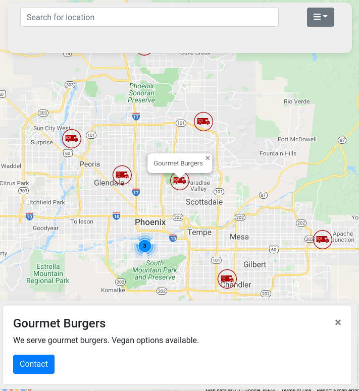

# vue-google-map-finder

Vue app that features router, vuex and google maps.



## Project setup

```
npm install
```

Add your own Google Maps Api key to `options.js`

### Compiles and hot-reloads for development

```
npm run serve
```

### Compiles and minifies for production

```
npm run build
```

### Lints and fixes files

```
npm run lint
```

### Customize configuration
See [Configuration Reference](https://cli.vuejs.org/config/).
